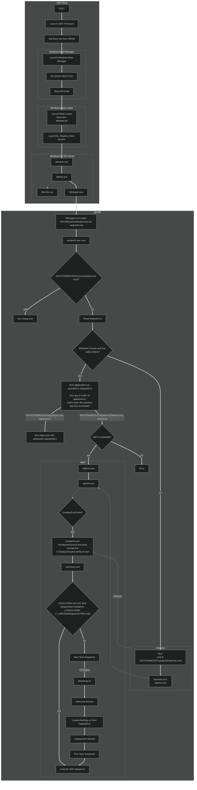

# Windows_PE
 

Automatic build &amp; customization of WinPE

- [Windows_PE](#windows_pe)
  * [Basic](#basic)
  * [Customization](#customization)
    + [Drivers](#drivers)
    + [Files](#files)
    + [Enabled components](#enabled-components)
    + [Inactive Components](#inactive-components)
  * [Documentation](#documentation)
    + [Full Windows UEFI Boot schematic of Windows PE](#full-windows-uefi-boot-schematic-of-windows-pe)

## Basic

- New-WinPE
- New-FolderStructure
  - _change bloated structure to MDT-based structure_
    -  Remove root language folders and sources
    -  Add MDT-structure and move `boot.wim` to `Deploy\Boot`
- Mount-WinPE
- Add-FilesToWinPE
  - _Loop over contents `source\_winpe`_
- Add-AppsToWinPE
  - _Download applications (portable) and installs to target path_
- Add-OptionalComponents
- Add-BootDrivers
  - _none, all, hp, dell, lenovo, vmware_
  - _Release will contain 'all'_
- Add-Updates
  - `Disabled`
- Invoke-WinPEcleanup
  -  `Disabled`
- Get-HashOfContents
  -  `Disabled` due to permsssion issue in boot.wim system files
- Dismount-Image
- Add-FilesToIso
  - _Loop over contents `source\_iso`_
- Set-BCDData
  - _Required due to folder structure change_
- New-ISO

_Screenshot after <15sec boot:_

## Customization
### Basic commands
- Mount  `Mount-WindowsImage -ImagePath "$ISO_root\Deploy\Boot\boot.wim" -index 1  -Path "$WinPE_root"`
- Unmount   `Dismount-WindowsImage -Path "$WinPE_root" -Save`
- ToISO   `makeWinPEMedia.cmd /ISO $workingDirectory\WinPE_$arch workingDirectory\WinPE_$arch.iso`

### Drivers
- `Add-WindowsDriver -Path "$WinPE_root" -Driver ".\source\Drivers\$branding" -verbose -Recurse"`

### Applications

- Launchbar 
  - Quicklaunch for apps
- DeploymentMonitoringTool.exe (included in source)
  - Get info about current machine
- CMTrace_amd64.exe (included in source)
  - Read MDT and other logs
- Process Explorer
- 7-Zip
- Powershell 7.2.2+
- Notepad++
- DoubleCMD
  - File Explorer as Explorer.exe is unavailable 
- Missing executables and added:
  - label
  - logman
  - runas
  - sort
  - tzutil
  - Utilman
  - clip
  - eventcreate
  - forfiles
  - setx
  - timeout
  - waitfor
  - where
  - whoami.exe

### Files
- WinPE (X:\)
  - Add to `$workingDirectory\WinPE_$arch\mount` folder.
  - Included files in `source\_winpe\Windows\System32` to be added to `$workingDirectory\WinPE_$arch\mount\Windows\System32`
    - CMTrace_amd64.exe
    - DeploymentMonitoringTool.exe
    - LaunchBar_x64.exe
    - launchbar.ini
    - test.bat
    - winpeshl.ini 
- ISO
  - Add to `"$workingDirectory\WinPE_$arch\media"` folder

### Enabled components

  
Click to show

    
- WinPE-HTA
- WinPE-WMI
- WinPE-NetFX
- WinPE-Scripting
- WinPE-SecureStartup
- WinPE-PlatformID
- WinPE-PowerShell
- WinPE-DismCmdlets
- WinPE-SecureBootCmdlets
- WinPE-StorageWMI
- WinPE-EnhancedStorage
- WinPE-Dot3Svc
- WinPE-FMAPI
- WinPE-FontSupport-WinRE
- WinPE-PlatformId
- WinPE-WDS-Tools
- WinPE-WinReCfg

    
#### Inactive Components

  
Click to show

    
- WinPE-Fonts-Legacy
- WinPE-Font Support-JA-JP
- WinPE-Font Support-KO-KR
- WinPE-Font Support-ZH-CN
- WinPE-Font Support-ZH-HK
- WinPE-GamingPeripherals
- Winpe-LegacySetup
- WinPE-MDAC
- WinPE-PPPoE
- WinPE-Rejuv
- WinPE-RNDIS
- WinPE-Setup
- WinPE-Setup-Client
- WinPE-Setup-Server
- WinPE-SRT
- WinPE-WiFi-Package

## Documentation

- [WinPE Optional Components](https://docs.microsoft.com/en-us/windows-hardware/manufacture/desktop/winpe-add-packages--optional-components-reference?view=windows-11)

## Full Windows UEFI Boot schematic of Windows PE

