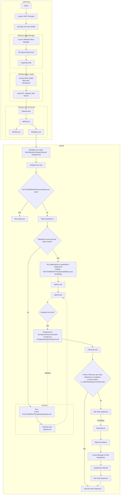

# Windows_PE
Automatic build &amp; customization of WinPE

## Basic

## Customization
- Mount  `Dism /Mount-Image /ImageFile:"C:\WinPE_amd64\media\sources\boot.wim" /index:1 /MountDir:"C:\WinPE_amd64\mount"`
- Unmount   `Dism /Unmount-Image /MountDir:"C:\WinPE_amd64\mount" /commit`
- ToISO   `MakeWinPEMedia /ISO C:\WinPE_amd64 C:\WinPE_amd64\WinPE_amd64.iso`

### Drivers
- `Dism /Add-Driver /Image:"C:\WinPE_amd64\mount" /Driver:"C:\SampleDriver\driver.inf"`

### Files
- Add to C:\WinPE_amd64\mount folder. 
  - These files will show up in the X:
- C:\WinPE_amd64\mount\Windows\System32\Startnet.cmd
  - `%SYSTEMROOT%\System32\Startnet.cmd`
- `Wpeinit -unattend:"C:\Unattend.xml"`
### Enabled components
- WinPE-HTA
- WinPE-WMI
- WinPE-NetFX
- WinPE-Scripting
- WinPE-SecureStartup
- WinPE-PlatformID
- WinPE-PowerShell
- WinPE-DismCmdlets
- WinPE-SecureBootCmdlets
### Optional Components

WinPE-DismCmdlets
WinPE-Dot3Svc
WinPE-EnhancedStorage
WinPE-FMAPI
WinPE-Fonts-Legacy
WinPE-Font Support-JA-JP
WinPE-Font Support-KO-KR
WinPE-Font Support-ZH-CN
WinPE-Font Support-ZH-HK
WinPE-GamingPeripherals
Winpe-LegacySetup
WinPE-MDAC
WinPE-PlatformID
WinPE-PPPoE
WinPE-Rejuv
WinPE-RNDIS
WinPE-Setup
WinPE-Setup-Client
WinPE-Setup-Server
WinPE-SRT
WinPE-StorageWMI
WinPE-WDS-Tools
WinPE-WiFi-Package
WinPE-WinReCfg
## Documentation

[WinPE Optional Components](https://docs.microsoft.com/en-us/windows-hardware/manufacture/desktop/winpe-add-packages--optional-components-reference?view=windows-11)

